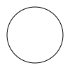
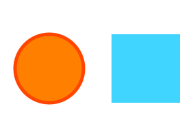

# blind-painter 🤖🎨

A simple template to use JavaScript browser drawing libraries like P5.js and Two.js in a headless node.js environment to run server-side.
Uses JSDOM and node-canvas, to run drawing scripts in a browser-like environment.

## Setup

`git clone` this repository

`npm install` the dependencies
 
 edit the `package.json` to fit your project and replace the examples with your code.

## Structure

`index.js` is the entry point of the application

`untils.js` contains convenience functions

`/scripts` is where the drawing scripts go

## Using the provided functions

### `run(scripts, data, callback)`
* Given an array of paths to scripts, runs those scripts in order inside of a JSDOM environment (with window and canvas)
* Returns the window object so you can extract the canvas element and save the image or simiar
* Data passed into `data` is available inside the scripts as `painter-data`
* If a script runs asynchronous code, and you need to know when it's done, you can dispatch a `painting-done` event on the 
`window.document` inside of the script, this event will trigger the `callback` parameter passed to the function, 
see the P5.js example, where this is done. The callback is not called unless this event is dispatched

### `saveCanvas(win, path, type, quality)`
* Given a window object (like the one returned by `run`), will find a canvas inside and save it as a .png image to the
provided path

